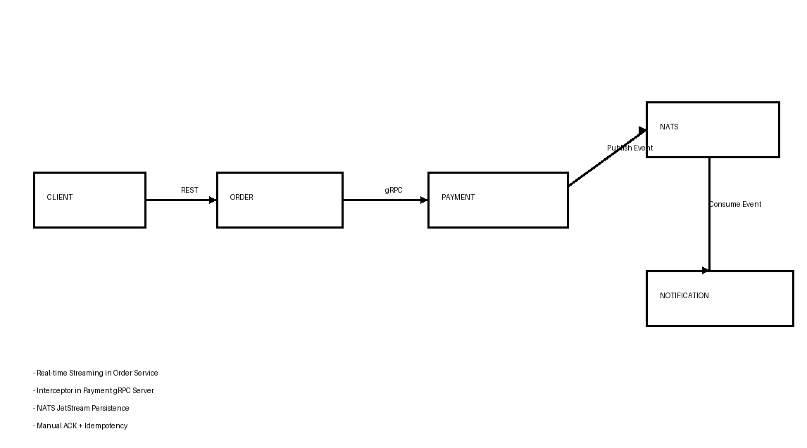

# AP2 Assignment 3 — Event-Driven Architecture with NATS

## Overview

This project extends the previous gRPC-based microservice system by adding Event-Driven Architecture using NATS JetStream.

Flow:

Client → Order Service → gRPC → Payment Service → NATS → Notification Service

## Services

### Order Service
- Exposes REST API for clients
- Calls Payment Service using gRPC
- Has gRPC streaming for order status updates

### Payment Service
- Processes payments through gRPC
- Saves payment data to PostgreSQL
- Publishes `payment.completed` event to NATS after successful payment creation

### Notification Service
- Consumes `payment.completed` events from NATS
- Simulates email sending by logging message details
- Does not directly call Order or Payment services

## Event Flow

After successful payment:

```json
{
  "event_id": "PAY-123",
  "order_id": "ORD-123",
  "amount": 50000,
  "customer_email": "user@example.com",
  "status": "Authorized"
}
```

Notification Service receives this event and prints:

```[Notification] Sent email to user@example.com for Order #ORD-123. Amount: 50000```

## Reliability
### Manual ACK

Notification Service uses manual acknowledgment.

Message is acknowledged only after successful processing:

- Message is received
- JSON is parsed
- Idempotency check is performed
- Notification log is printed
- Message is ACKed

If processing fails, the message is not acknowledged.

### Persistence

NATS JetStream is used for message persistence.


### The stream:

```PAYMENT_EVENTS```

### listens to subject:

```payment.completed```

This allows messages to survive consumer restarts.

## Idempotency

Notification Service uses an in-memory store of processed event_id values.

If the same event is delivered twice, it is skipped:

```duplicate event skipped: PAY-123```

This prevents duplicate notification sending.

### Graceful Shutdown

Services handle termination signals using:

``` 
    os.Signal
    SIGINT
    SIGTERM 
```


On shutdown:

- HTTP server is stopped gracefully
- gRPC server is stopped gracefully
- NATS connections are closed

## Start NATS with JetStream
```bash
docker run -p 4222:4222 -p 8222:8222 nats -js
```


### Create Order
```http request
POST http://localhost:8080/orders
```

```json
{
"customer_id": "CUST-1",
"item_name": "Phone",
"amount": 50000
}
```

